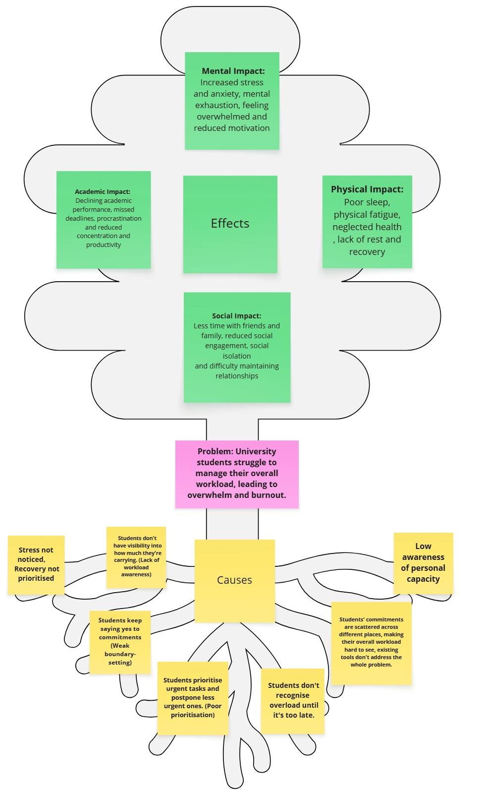
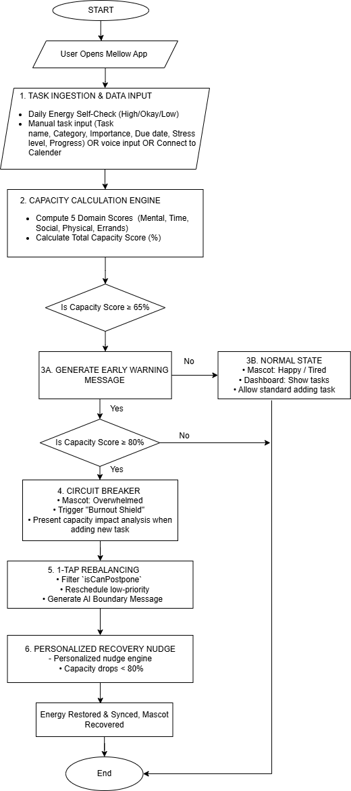
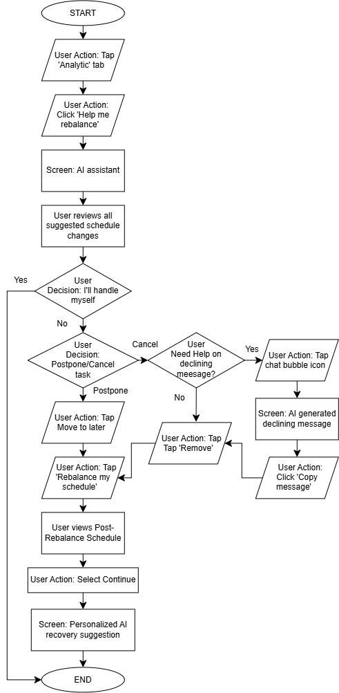
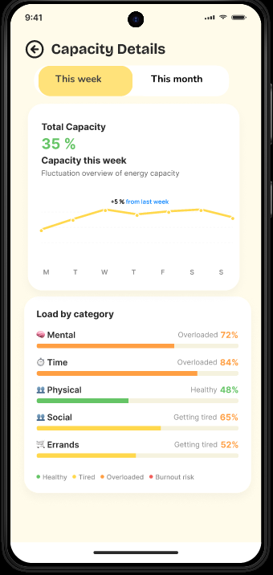
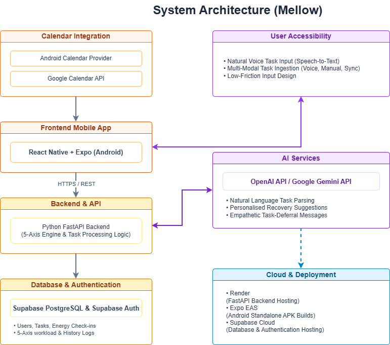

# MELLOW by COLL666
**Team:** Chuah Yan Shen, Lim Zhi Ying, Lim Jia Ying, Ooi Wei Jin
**Problem Statement:** Stress & Workload Manager
**Video Presentation:** [Unlisted Youtube Link] 
**Presentation Slides:** [Public Link] 

# 📌 Project Overview

## 🚨 The Problem

University students often manage academic work, part-time jobs, social commitments, physical needs, and everyday errands separately, making it difficult to understand their **overall workload versus their actual capacity**.

Without this visibility, students may overcommit, postpone less urgent tasks, neglect recovery, and gradually become overwhelmed. Burnout is rarely caused by one task, but by the **accumulation of multiple demands across different areas of life**.

## 👥 Stakeholders

- **Primary:** University students managing multiple responsibilities.
- **Secondary:** Educational institutions and student-support teams affected by student stress, disengagement, and reduced performance.

## 🔍 Existing Solutions & Gap

**Motion / Sunsama:** Strong at scheduling and time-blocking, but focus mainly on productivity rather than changing energy levels, recovery, and burnout prevention.

> **Gap:** Existing tools help users manage *what needs to be done*, but do not help them understand **how much they can realistically handle**.

## 💡 Our Solution

**Mellow** is a capacity-aware workload management app designed to help university students **prevent burnout before it occurs**.

It combines five workload areas — **Mental, Time, Physical, Social, and Errands** — into a single **0–100% capacity score**, visualised through a **Digital Mascot Companion**.

When workload reaches a high threshold, Mellow acts as a **"circuit breaker"** by automatically deferring low-priority tasks and suggesting small recovery actions.

This helps students:
- 👀 Understand their overall workload
- 🧠 Reduce decision fatigue
- ⚖️ Rebalance tasks before overload
- 🌱 Maintain a healthier balance between productivity and recovery

# ✨ Features

## 🐾 Top 3 Core Features

### 1. Digital Mascot Companion & Workload Visualizer

- **Unified Capacity Score (0–100%):** Combines 5 dimensions (Mental, Time, Physical, Social, Errands) into a real-time stress rating.
- **Living Stress Mirror:** An evolving visual pet that reflects current stress through changing expressions and moods.
- **Multi-Dimensional Capacity Wheel:** Calculates and visualizes capacity status.
- **Emotion-Driven Visual Clarity:** Uses Green (Energetic/Happy), Orange (Tired/Anxious), and Red (Overwhelmed/Exhausted) states for quick understanding.

### 2. 🛡️ Proactive Burnout Shield & Circuit Breaker

- **65% Capacity Early Warning:** The mascot becomes tired and sends a gentle alert when workload starts rising.
- **80% Capacity Circuit Breaker:** Triggers a UI intervention requiring a task progress update, followed by AI postponement recommendations and a micro-recovery nudge.
- **"Should I Say Yes?" Gatekeeper:** When capacity exceeds 80%, prompts users to Accept, Decline, or Decide Later before taking on a new task.

### 3. ⚖️ Active Load Balancer & AI-Powered Recovery Nudges

- **1-Tap Rebalancing:** Moves low-priority tasks and non-essential activities to lower-workload days.
- **Contextual AI Recovery:** Provides personalised recovery actions based on the user's highest-stress area when capacity exceeds 80%.
- **Instant Recovery Bonus:** One-tap completion of recovery actions reduces the capacity-used score and restores the mascot's energy.
- **Custom Recovery Nudge:** Lets students choose predefined recovery actions for immediate stress relief.

---

## 🔧 Supporting Feature Set

### 📋 Smart Task Prioritization & Workload Management

- **Impact vs. Effort Scoring:** Ranks tasks based on deadline proximity, consequences, and stress contribution.
- **Granular Milestone Tracking:** Tracks progress at 0%, 25%, 50%, 75%, and 100% to reduce all-or-nothing task paralysis.

### 🤖 AI & Rule-Based Automation Engine

- **Predictive AI Workload:** Forecasts upcoming workload, identifies stress spikes, and flags high-risk days.
- **Speech-to-Task AI:** Converts spoken input into structured tasks automatically.
- **AI Schedule Adjuster:** Detects peak workload and suggests ways to defer flexible social or group commitments.
- **Auto-Rearranger:** Reschedules postponable errands and social activities based on predefined rules.

2. Ideation & Process
## 💭 2.1 Ideas We Considered

| Idea | Decision & Rationale |
|---|---|
| **Workload Visualizer & Capacity Tracking** | ✅ **Chosen** — Directly addresses the core problem by showing workload across Mental, Time, Physical, Social, and Errands. |
| **Empathetic Digital Mascot** | ✅ **Chosen** — Makes burnout interventions feel friendly and supportive rather than clinical or judgmental. |
| **Smart Load Balancer & Task Triage** | ✅ **Chosen** — Actively reduces overload by prioritising tasks and suggesting schedule adjustments. |
| **Actionable Recovery Nudges** | ✅ **Chosen** — Encourages simple, screen-free recovery actions such as walking, resting, or hydrating. |
| **Automated Boundary-Setting Messages** | ✅ **Chosen** — Reduces the stress of saying “no” by helping students communicate deadline changes or declined commitments. |
| **In-App Mini Games** | ❌ **Dropped** — Would increase screen time and distract from genuine, offline recovery. |
| **AI Assignment Downscaling** | ❌ **Dropped** — Cannot realistically change academic requirements or grading rubrics. |
| **Happiness Level Tracking** | ❌ **Dropped** — Mood alone does not accurately represent workload or energy capacity. |
| **Point-Based Reward System** | ❌ **Dropped** — Gamifying rest could create additional pressure and undermine the goal of burnout prevention. |

##  2.2 Ideation Boards
## 🧠 Mindmaps

This mindmap maps out how **Mellow** helps students monitor stress and manage workload before reaching overload. It connects daily tasks, real-time capacity tracking, smart recommendations, workload rebalancing, and recovery actions.

## 🌳 Problem Trees

This problem tree explores the **root causes and effects** of students struggling to manage their overall workload. It connects issues such as low capacity awareness, poor prioritisation, weak boundaries, and delayed recognition of overload to mental, physical, social, and academic impacts.

## 🔄 Flowcharts

This flowchart shows how **Mellow's capacity-management system** transforms user energy and workload data into a Capacity Used Score. It demonstrates how the system progresses from normal task management to early warnings, circuit-breaker protection, task rebalancing, and personalised recovery.

## 👤 User Flows

**1. Daily Check-In Flow**

This shows how the user starts their day in the app, with different paths for new and returning users:
* **New Users:** Complete the 5-step assessment, select their daily energy ("Low," "Okay," or "High"), and enter the Home Dashboard.
* **Returning Users:** Skip directly to the daily energy selection, then enter the Home Dashboard.

**2. Adding a Task Flow**

When the user adds a new task via the "Tasks" tab, the system responds based on their resulting workload capacity:
* **Under 65%:** The task is added to the list normally.
* **Hits 65%:** The task is added, but triggers a heavy load warning alert.
* **Hits 80%:** The new task is paused, and the AI recommendation screen appears. If the user accepts the AI's advice, the new stressful task is not added.

**3. Rebalance Flow**

To rebalance an overloaded schedule via the "Analytic" tab, the user can:
* **Skip:** Tap "I'll handle myself" to reject all AI suggestions.
* **Modify:** Select "Remove" or "Move to later" only for tasks to change, and simply ignore the options if no changes are needed.
* **Cancel Events:** Tap the chat bubble to copy an AI-generated cancellation message.
* **Apply:** Tap "Rebalance My Schedule" to update the timeline and view personalized AI recovery suggestions.

**4. Recovery Nudge Flow**

To restore energy via the "Recovery" tab, the user can update their status in two ways:
* **Individual:** Tap "Done" next to a specific completed activity (e.g., 15-minute walk).
* **All at once:** Tap the yellow "I'm ready" button to automatically mark all activities as finished.

## 🧑‍🏫 2.3 Mentor Consultation

| Date | Mentor | Feedback Received | What Was Changed |
|---|---|---|---|
| **4/9/2026** | **Teng Wei Herr** | How does the system determine capacity? | Calculated stress by category and used the average to determine capacity. |
| **4/9/2026** | **Teng Wei Herr** | How do we know user progress for each task? | Added task progress updates through user input. |
| **4/9/2026** | **Teng Wei Herr** | Connect the system to a calendar. | Added Google Calendar integration to sync relevant tasks and scheduled activities. |
| **4/9/2026** | **Teng Wei Herr** | Forecast upcoming workload and stress. | Added stress forecasting with task rebalancing recommendations. |
| **4/9/2026** | **Teng Wei Herr** | Use AI for personalised nudges, but not general capacity calculations. | Kept capacity calculations rule-based and used AI for personalised nudges and recommendations. |
| **4/9/2026** | **Teng Wei Herr** | Consider adding gamification. | Explored the idea but found it difficult to implement within the project scope. |
| **4/9/2026** | **Teng Wei Herr** | Explore existing applications for inspiration. | Reviewed wellness, productivity, and task-management applications. |
| **4/9/2026** | **Daniel Koh Yu Hang** | Use NLP to extract task information from natural language. | Added natural-language task input with automatic task and deadline extraction. |
| **4/9/2026** | **Daniel Koh Yu Hang** | Ask users for missing task information. | Added a clarification step when task details are incomplete. |
| **4/9/2026** | **Daniel Koh Yu Hang** | Let users review AI-extracted information before saving. | Added a confirmation step before storing AI-generated task information. |
| **4/9/2026** | **Daniel Koh Yu Hang** | Consider Google Sign-In. | Added Google Sign-In as an authentication option. |
| **4/9/2026** | **Daniel Koh Yu Hang** | Use AI only for personalised responses. | Limited AI usage to personalised recommendations and responses. |
| **4/9/2026** | **Daniel Koh Yu Hang** | Explain AI recommendations and allow modification. | Added explanations and options to modify or reject recommendations. |
| **4/9/2026** | **Daniel Koh Yu Hang** | Ensure the mascot solves a real problem rather than being decorative. | Refined the mascot to visually communicate AI outputs and workload states. |
| **10/9/2026** | **Teng Wei Herr** | Place manual task creation and calendar syncing together. | Placed **Add Task** and **Calendar Integration** side by side. |
| **10/9/2026** | **Teng Wei Herr** | Make the workload comparison the focus and highlight overloaded weeks. | Added a **This Week vs. Next Week** comparison with visual overload indicators. |
| **10/9/2026** | **Teng Wei Herr** | Keep reminder messages short and actionable. | Shortened reminders and made them more visual and direct. |
| **10/9/2026** | **Teng Wei Herr** | Keep engagement lightweight and avoid strict streaks. | Removed streaks and focused on simple, low-pressure interactions such as mascot check-ins. |

3. Design & Prototype
UI Prototype: https://www.figma.com/proto/Z5bfmgFRdOzC3FEHma1vk5/Mellow--Real-Prototype-?node-id=6-711&p=f&t=a2nfJ5dnzjCWw9Xt-1&scaling=scale-down&content-scaling=fixed&page-id=0%3A1&starting-point-node-id=6%3A711&show-proto-sidebar=1

|||
| --- | --- |
| Screen 1 — Main Dashboard & workload visualizer | Screen 2 — View task and add task |
|||
|Screen 3 — Analytics and forecast|Screen 4 — Recovery nudge|
|||
|Assistant & Recommendation page|Rebalance page (When capacity >= 80)|
||| 
| Post-rebalance schedule | Personalized recovery suggestion |
|  | |
| Capacity Details | |

# 💡 4. What Makes It Different

Mellow focuses on **capacity management and burnout prevention**, rather than simply helping users complete more tasks.

## 🌟 Novel Features

| Novel Feature | Originality / Twist |
|---|---|
| **1. Unified 5-Dimension Capacity Score** | Combines Mental, Time, Physical, Social, and Errands into one 0–100% capacity score. |
| **2. Digital Mascot Stress Mirror** | Mascot mood changes with workload, making stress instantly visible. |
| **3. 65% Early Warning** | Warns users before they become overwhelmed, enabling early intervention. |
| **4. 80% Burnout Circuit Breaker** | Actively intervenes at high capacity instead of simply displaying an alert. |
| **5. “Should I Say Yes?” Gatekeeper** | Prevents over-commitment by prompting users to accept, decline, or delay new tasks. |
| **6. Dual-Layer Workload Protection** | Prevents additional workload while also reducing existing workload when capacity is exceeded. |
| **7. 1-Tap Load Rebalancing** | Automatically postpones low-priority tasks to lower-workload periods. |
| **8. Stress-Aware Prioritization** | Considers stress alongside deadline and task importance. |
| **9. Recovery-to-Capacity Feedback** | Recovery actions can improve the user's capacity state, connecting rest with workload management. |
| **10. Contextual Recovery Nudges** | Suggests recovery actions based on the user's main source of stress. |
| **11. Granular Task Progress** | Uses 0%, 25%, 50%, 75%, and 100% milestones to reduce task pressure. |
| **12. Burnout Prevention Focus** | Prioritises protecting user capacity rather than maximising productivity. |

## ⚔️ Comparison with Existing Solutions

| Aspect | Motion | Gap | Mellow |
|---|---|---|---|
| **Main Focus** | Productivity & AI scheduling | Focuses on task management | **Burnout prevention & capacity management** |
| **Workload Management** | Schedules and reschedules tasks | Does not measure overall user capacity | **Measures 5 workload dimensions** |
| **Capacity Awareness** | ❌ | Users cannot see how much they can realistically handle | **✓ 0–100% capacity score** |
| **Burnout Prevention** | Limited | No proactive workload protection | **✓ Early warning + circuit breaker** |
| **Task Adjustment** | Automatically reschedules tasks | Mainly optimises schedules | **✓ Defers low-priority tasks when overloaded** |
| **Recovery** | ❌ | Workload is rarely connected to recovery | **✓ Personalised recovery nudges** |

### 🔑 Key Difference

> **Motion:** “How can I fit everything into my schedule?”  
> **Mellow:** “How much can I realistically handle, and what should change when I can't?”

### 🚀 What Makes Mellow Novel?

Mellow's novelty lies in combining **multi-dimensional workload measurement, capacity-based intervention, automatic workload rebalancing, and recovery** into one proactive burnout-prevention loop.

# 🏗️ 5. Technical Architecture & Feasibility

## 🛠️ Tech Stack

| Layer | Technology | Rationale | Constraints & Mitigations |
|---|---|---|---|
| **Frontend / Mobile** | **React Native + Expo (Android)** | Enables rapid cross-platform development, physical-device testing, and easy APK builds. | **Constraint:** Complex animations may affect performance. **Mitigation:** Use Reanimated/Lottie and optimise re-renders. |
| **Backend & APIs** | **FastAPI (Python)** | Handles capacity calculations, task processing, workload rebalancing, and custom APIs. | **Constraint:** Free hosting may cause cold starts. **Mitigation:** Keep dependencies lightweight and use loading states. |
| **Database** | **Firebase Firestore** | Provides a scalable cloud NoSQL database with easy React Native integration and real-time synchronisation. | **Constraint:** Read/write usage can increase costs beyond the free quota. **Mitigation:** Minimise unnecessary queries and cache frequently used data. |
| **Authentication** | **Firebase Authentication** | Provides simple email/password and Google Sign-In authentication. | **Constraint:** OAuth setup requires additional configuration. **Mitigation:** Use email/password for the MVP and enable Google Sign-In if time permits. |
| **AI Services** | **OpenAI API / Google Gemini API** | Supports natural-language task input, personalised recovery suggestions, and empathetic messages. | **Constraint:** API latency, rate limits, and usage costs. **Mitigation:** Keep core capacity calculations rule-based and provide fallback responses. |
| **Calendar Integration** | **Android Calendar Provider + Google Calendar API** | Imports existing calendar events so fixed commitments contribute to capacity assessment. | **Constraint:** Requires calendar permissions and provider compatibility. **Mitigation:** Use read-only access and provide manual task entry as a fallback. |
| **Hosting** | **Render (Free Tier)** | Hosts the FastAPI backend online with HTTPS and simple deployment. | **Constraint:** Free services may sleep after inactivity. **Mitigation:** Start the backend before the demonstration and prepare a local fallback. |
| **Mobile Build** | **Expo EAS** | Generates Android APK builds for testing and demonstration. | **Constraint:** Cloud build limits or queues may delay builds. **Mitigation:** Use Expo Go during development and prepare the APK early. |
| **Version Control** | **GitHub** | Supports team collaboration, feature branches, and version tracking. | **Constraint:** Merge conflicts. **Mitigation:** Separate work by feature and use regular merges. |

## 🔄 System Architecture

## 🛠️ Build Plan & Scope

> Explicitly tell the reviewer what you plan to build during the building phase. Narrow scope will read as realistic and feasible, not as a lack of ambition.

## 📅 Development Plan

| Timeline | Build Focus | Features / Functions to Implement | Expected Output |
|---|---|---|---|
| **Day 1–2** | **System Foundation & UI** | Set up Mellow application structure, database, navigation, task model, workload categories, and basic dashboard UI. | Working app structure with Dashboard, Tasks, and Settings screens. |
| **Day 3–4** | **Task & Workload Management** | Implement task creation, editing, deletion, deadlines, workload category, stress level, importance, and progress milestones (0%, 25%, 50%, 75%, 100%). | Complete task management system. |
| **Day 5–6** | **Capacity Calculation** | Implement the five workload dimensions (Mental, Time, Physical, Social, Errands) and the 0–100% Unified Capacity Score. | Working capacity calculation connected to user tasks. |
| **Day 7–8** | **Digital Mascot & Visualization** | Develop the capacity wheel and Digital Mascot states that change according to the user's workload level. | Users can visualize their current workload and capacity. |
| **Day 9–10** | **Burnout Shield & Circuit Breaker** | Implement the 65% Early Warning and 80% Circuit Breaker. At 80%, trigger workload alerts and require task progress updates. | Mellow actively responds when workload becomes high. |
| **Day 11–12** | **Commitment & Load Balancing** | Implement the "Should I Say Yes?" Gatekeeper and rule-based 1-Tap Rebalancing to postpone low-priority/non-essential tasks. | Users can prevent over-commitment and reduce workload. |
| **Day 13–14** | **Recovery System** | Implement recovery nudges based on the user's highest workload area and connect recovery actions to capacity changes. | Actionable recovery suggestions with capacity feedback. |
| **Day 15–16** | **AI Assistance & Personalization** | Implement limited AI-powered recovery recommendations and personalized recovery messages. AI supports recommendations rather than calculating the core capacity score. | Personalized recovery advice when capacity is high. |
| **Day 17–18** | **Workload Forecasting & Refinement** | Add basic workload forecasting and refine task prioritization, capacity calculations, and intervention rules. | Improved workload awareness and recommendations. |
| **Day 19** | **System Integration** | Connect the complete workflow from task input to capacity calculation, intervention, rebalancing, and recovery. | Fully integrated prototype. |
| **Day 20** | **Testing & Bug Fixing** | Test capacity calculations, task prioritization, circuit-breaker triggers, task postponement, mascot states, AI recommendations, and edge cases. | Stable prototype with major bugs resolved. |
| **Day 21** | **UI/UX & Demo Preparation** | Polish UI, mascot states, animations, error handling, demo data, documentation, and final demonstration scenario. | Final polished prototype ready for demonstration. |

